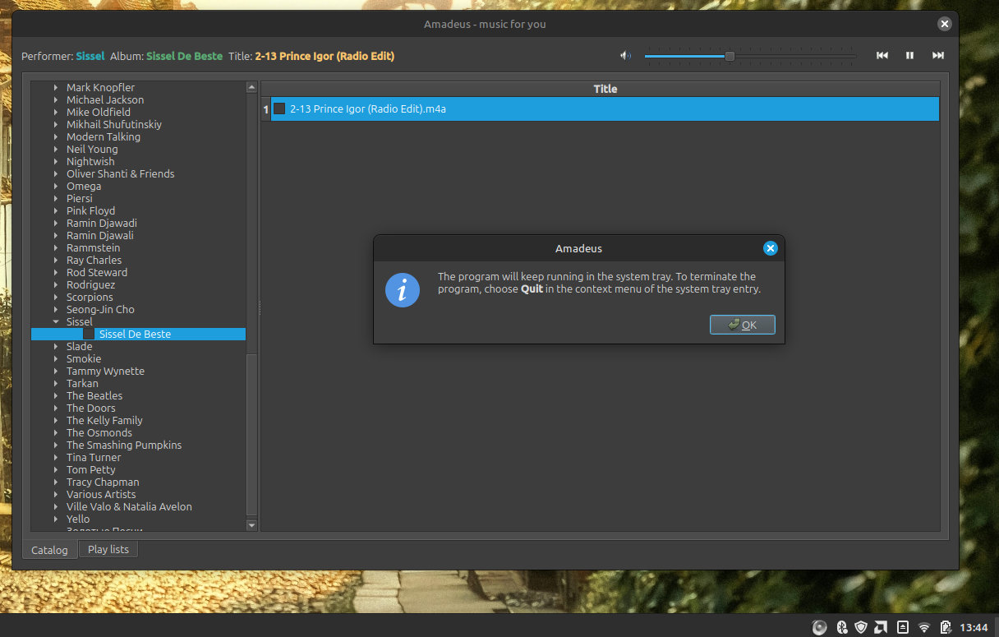

# Amadeus - music for you

Amadeus is my own implementation of a music player. The program is written in C++ using the Qt library (QtCreator 14.0.2) on Linux.  
The program expects music files in the format: performer->album->song. 
After closing the main program window, it will be available in the system tray.

The laudspeaker in tray it is Amadeus.

